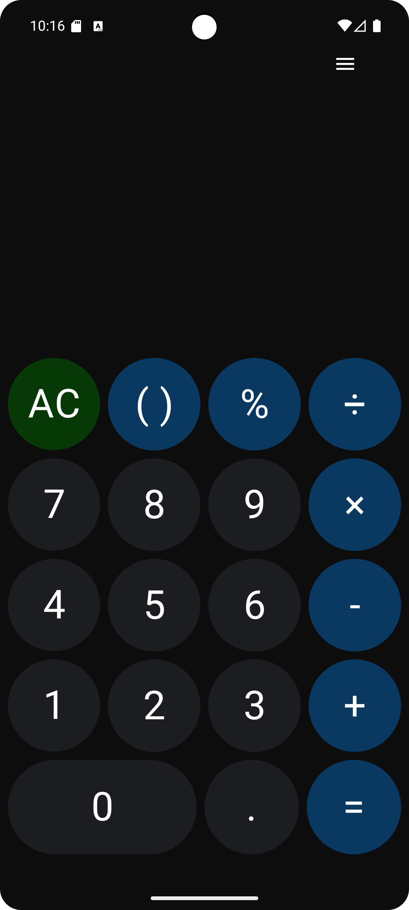
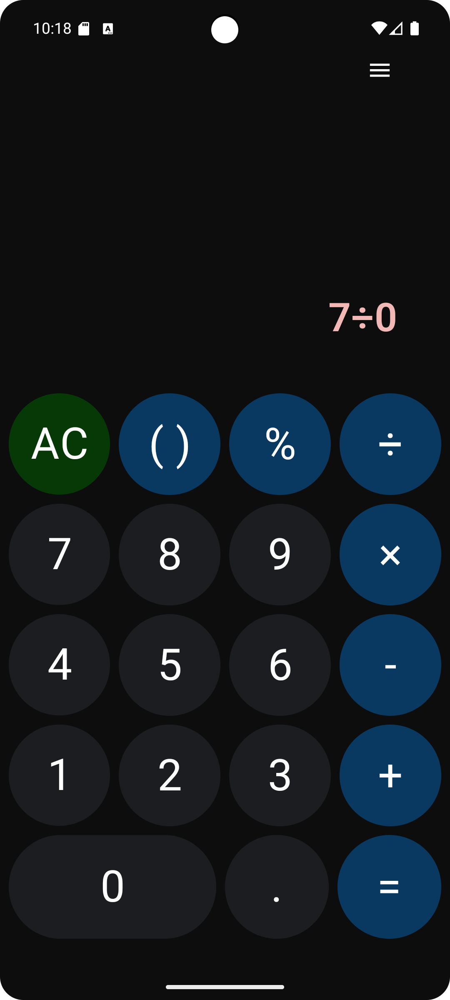

#  Native Calculator

**Native Calculator** — это простое Android-приложение-калькулятор, в котором все основные математические операции реализованы через нативный код на C++ с использованием JNI.

Это тестовое задание выполнено в полном объёме, с добавлением дополнительных возможностей:  
🔹 Экран истории расчетов  
🔹 Архитектура **MVVM + Clean Architecture**  
🔹 Внедрение зависимостей через **Hilt**

---

##  Внешность

Главный экран | Экран истории вычислений | Обработка ошибок  
:--:|:--:|:--:  
 |  | 


---

## ✅ Требования

### 🔹 Основной функционал

- [x] Поля ввода двух чисел (EditText)
- [x] Кнопки для операций: `+`, `-`, `×`, `÷`
- [x] Вывод результата (TextView)
- [x] Все вычисления производятся в **нативном коде (C++) через JNI**
- [x] Возврат результата из C++ в Kotlin и отображение на экране

### 🔸 Дополнительные возможности

- [x] Обработка ошибок:
  - Деление на ноль
  - Пустые или некорректные поля
- [x] Логгирование операций в C++ через `__android_log_print`
- [x] CMake-сборка нативной библиотеки
- [x] Экран с историей всех вычислений
- [x] Unit-тесты для проверки нативных методов

---

## Используемые технологии

- **Kotlin**
- **C++** (через **JNI**)
- **CMake** — сборка нативного кода
- **Hilt** — внедрение зависимостей
- **ViewModel / StateFlow** — управление состоянием
- **MVVM + Clean Architecture**
- **Jetpack Navigation** — навигация между экранами
- **Room** — хранение истории вычислений
- **JUnit** — модульные тесты для JNI

---

##  Архитектура

Проект построен по принципам **Clean Architecture**:
- `data` — реализация репозиториев, работа с Room
- `domain` — бизнес-логика и use-case'ы
- `presentation` — UI, ViewModel, управление состоянием

---

##  Запуск проекта

1. Клонировать репозиторий:
```bash
git clone https://github.com/arnolddds/calculatorApp_info_tecs_25.git
```
##  Контакты
Telegram @arnoldsss

